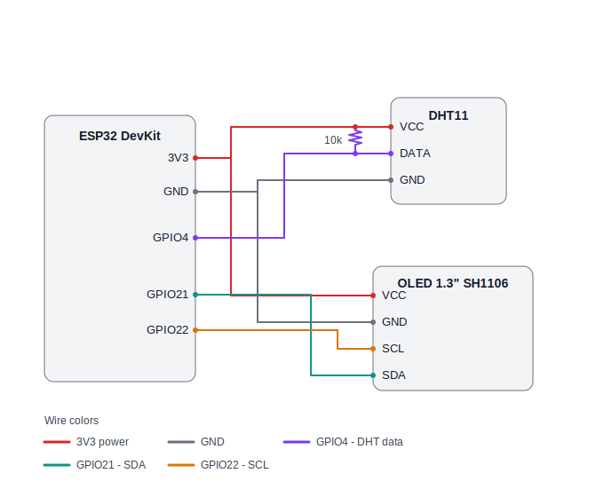

# ESP32 Temperature & Humidity Monitor

A 24/7 lab environment monitor built on an ESP32 + DHT11 + 1.3" OLED.
It shows live readings on the display and logs averaged data (with standard
deviation) to a **Google Sheet** — no server required, configured entirely
from your phone.



## Features

- **Live display** — temperature & humidity on a 128×64 OLED, refreshed every 10 s
- **Google Sheets logging** — every 10 min uploads the window's **mean ± SD** and sample count via a Google Apps Script Web App (first record sent right after startup)
- **Phone-based setup** — the device opens its own WiFi hotspot with a captive portal; no credentials are hard-coded in the firmware
- **Offline buffering** — if the internet drops, records are queued in RAM (up to 24 h) and flushed automatically when connectivity returns, with correct NTP timestamps
- **Captive-portal detection** — distinguishes "no internet" from "a login page is blocking us" and shows it on screen
- **Offline mode** — display-only operation with WiFi fully off, selectable from the setup page
- **Power optimized** — 80 MHz CPU, WiFi radio off between uploads, light sleep between samples (~10× lower average draw)
- **OLED burn-in protection** — periodic pixel-shift plus reduced contrast
- **Factory reset** — hold the BOOT button ~3 s while running

## Hardware

| Part | Notes |
|---|---|
| ESP32 dev board | Classic ESP32 DevKit **or** ESP32-C3 SuperMini (auto-detected at compile time) |
| DHT11 sensor | ±2 °C, ±5 %RH. A DHT22 drops in for better accuracy (change `DHTTYPE`) |
| 1.3" OLED 128×64, I2C | Usually **SH1106** controller. 0.96" modules are usually SSD1306 — see [Troubleshooting](#troubleshooting) |
| 10 kΩ resistor | Pull-up on the DHT11 data line (skip if your DHT11 is a 3-pin breakout — it's built in) |

### Wiring — ESP32 DevKit

| Signal | ESP32 pin |
|---|---|
| DHT11 DATA | GPIO4 (+10 kΩ pull-up to 3V3) |
| OLED SDA | GPIO21 |
| OLED SCL | GPIO22 |
| DHT11 / OLED VCC | 3V3 (**not** 5V) |
| DHT11 / OLED GND | GND |

### Wiring — ESP32-C3 SuperMini

| Signal | C3 pin |
|---|---|
| DHT11 DATA | GPIO4 (+10 kΩ pull-up to 3V3) |
| OLED SDA | GPIO5 |
| OLED SCL | GPIO6 |
| DHT11 / OLED VCC | 3V3 |
| DHT11 / OLED GND | GND |

> **Note (C3):** ignore the SDA/SCL labels printed for GPIO8/GPIO9 on SuperMini
> pinout charts — GPIO9 carries the BOOT button and GPIO8 is a strapping pin.
> This firmware uses GPIO5/GPIO6 instead.
>
> **OLED labeled SCK instead of SCL?** Same pin — on I2C OLED modules
> SCK = SCL (clock). A 4-pin module (VCC/GND/SCK/SDA) is I2C.

## Building & flashing

1. Arduino IDE with the **ESP32 board package** (Boards Manager → "esp32" by Espressif).
2. Install libraries (Library Manager):
   - **DHT sensor library** (Adafruit) + **Adafruit Unified Sensor**
   - **U8g2** (oliver)
3. Board settings:
   - DevKit: board **"ESP32 Dev Module"**
   - SuperMini: board **"ESP32C3 Dev Module"**, **USB CDC On Boot: Enabled**
   - **Partition Scheme: "Huge APP (3MB No OTA/1MB SPIFFS)"** — the build is large
   - If flashing fails at high speed, drop **Upload Speed** to 115200
4. Open `Temp_Humid_monitor.ino`, select your port, upload. The correct pin map
   is chosen automatically per target chip.

## Google Sheets setup (Apps Script)

1. Create a Google Sheet. In row 1 add headers:

   `Timestamp | Temp_avg | Temp_SD | Hum_avg | Hum_SD | Samples`

2. **Extensions → Apps Script**, replace the contents with:

   ```javascript
   function doGet(e) {
     var sheet = SpreadsheetApp.getActiveSpreadsheet().getSheetByName('Sheet1');
     var p = e.parameter;
     var ts = Number(p.ts);
     // ts = UTC epoch seconds from the device (0 if its clock wasn't synced);
     // fall back to server time so no record is ever lost.
     var when = (ts && ts > 0) ? new Date(ts * 1000) : new Date();
     sheet.appendRow([
       when,
       Number(p.temp), Number(p.temp_sd),
       Number(p.hum),  Number(p.hum_sd),
       Number(p.n)
     ]);
     return ContentService.createTextOutput('OK');
   }
   ```

3. **Deploy → New deployment → Web app**:
   - *Execute as:* **Me**
   - *Who has access:* **Anyone**
4. Copy the Web App URL (ends in `/exec`) — you'll paste it into the device's
   setup page in the next section.
5. Set the sheet's timezone (**File → Settings → Time zone**) — timestamps are
   stored in UTC and displayed in the sheet's zone.

> After editing the script later, you must **Deploy → Manage deployments →
> Edit → New version**, or the change won't go live.
>
> ⚠️ Treat the `/exec` URL like a password — anyone who has it can append rows
> to your sheet. Don't commit it to a public repo.

## First-time setup (from your phone)

1. Power the device. With no configuration saved it opens a WiFi hotspot:
   **`LabMonitor-Setup`** (the OLED shows `SETUP MODE`).
2. Join it from your phone. The setup page pops up automatically
   (or browse to `http://192.168.4.1`).
3. Fill in your **WiFi SSID**, **password** (leave blank for an open network),
   and the **Google Script URL** from above → **Save & Reboot**.
   - Or tap **Run Offline (display only)** to skip WiFi entirely.
4. The device reboots, connects, sends the first record, and settles into
   normal operation.

### OLED status tag (top-right corner)

| Tag | Meaning |
|---|---|
| `NET` | All data uploaded |
| `BUF` | Records buffered — no internet, will retry automatically |
| `CAP` | A **captive portal** (login page) is blocking the internet |
| `OFF` | Offline mode (display only) |
| `...` | Starting up (before the first upload) |

### Reset / reconfigure

- **Factory reset:** let the board boot, then **hold BOOT ~3 s while it is
  running**. A countdown appears, config is erased, and setup mode returns.
  - ⚠️ Holding BOOT **during power-up** does *not* reset — that enters the
    serial flash bootloader (it's how firmware is uploaded).
- **WiFi changed/unreachable:** the device automatically reopens the setup
  hotspot for 5 minutes, then reboots and retries — so brief outages self-heal.
- **Locked out?** Erase everything and start over:
  `esptool --chip <esp32|esp32c3> --port <PORT> erase-flash`, then re-upload.

## Networks with a login page (universities, hotels)

If your WiFi is open but shows a browser login (captive portal), the ESP32
will associate but uploads will fail — the tag shows `CAP`. Options, best first:

1. **Register the device's MAC** with your network admin for portal exemption.
2. **Travel router** (e.g. TP-Link MR3020 in WISP mode): it joins the campus
   WiFi and rebroadcasts a clean WPA2 network. Log in to the portal **once from
   a phone connected to the travel router's network** (this authorizes the
   router's MAC), then point the ESP32 at the router's WiFi. Registering the
   *router's* MAC with IT makes it permanent.

## Data format

Each upload is an HTTP GET to the Apps Script URL:

```
...?temp=25.31&temp_sd=0.12&hum=61.20&hum_sd=0.85&n=58&ts=1751778000
```

`temp`/`hum` are the window means, `*_sd` sample standard deviations (n−1),
`n` the sample count, `ts` the UTC epoch of the window's end (0 = clock unsynced).

## Troubleshooting

| Symptom | Fix |
|---|---|
| Blank screen | Run the sketch in [`i2c_scanner/`](i2c_scanner) — expect the OLED at `0x3C`. Nothing found → check wiring/power. Found but still blank → your panel is SSD1306: swap the `U8G2_SH1106_...` constructor for `U8G2_SSD1306_128X64_NONAME_F_HW_I2C` |
| Display garbled / shifted 2 px | Wrong controller — same constructor swap as above (in reverse) |
| `DHT read failed` in Serial Monitor | Check the data-line pull-up, wiring, and 3V3 supply |
| Upload/flash fails midway | Lower Upload Speed to 115200; use a known-good USB **data** cable; disconnect OLED/DHT during flashing |
| Serial Monitor silent (C3) | Enable **USB CDC On Boot**; light sleep can also drop the USB console — set `ENABLE_LIGHT_SLEEP 0` while debugging |
| Sketch overflows flash | Set Partition Scheme to **Huge APP (3MB)** |
| Tag stuck on `BUF` | Upstream internet problem — check the router. Serial shows `Connectivity check: HTTP <code>`: `204` = internet OK, `302/200` = captive portal, negative = traffic dropped |
| Tag stuck on `CAP` | Log in to the network's portal page (see section above) |
| Data uploads but SD looks quantized | DHT11 resolution is 1 °C / 1 %RH — normal. Use a DHT22 for finer data |

## Repository contents

| File | Purpose |
|---|---|
| `Temp_Humid_monitor.ino` | Main firmware (DevKit + C3, auto-selected) |
| `i2c_scanner/i2c_scanner.ino` | Helper sketch to find the OLED's I2C address |
| `wiring_diagram.svg` | Wiring diagram (DevKit pinout) |

## License

MIT — see [LICENSE](LICENSE) (or adapt to your preference).
